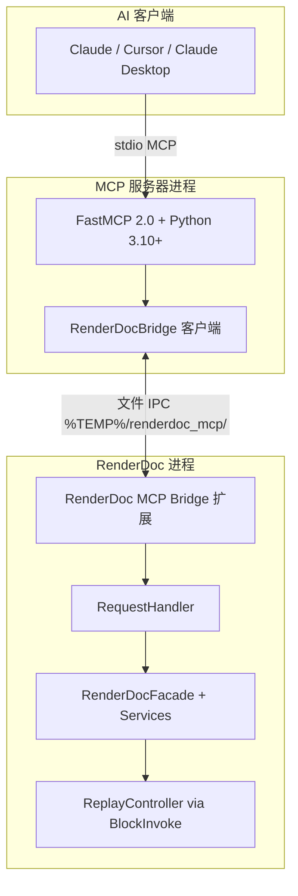

# RenderDocMCP 工程详细说明

RenderDocMCP 是一个 **MCP（Model Context Protocol）服务器**，让 Claude、Cursor 等 AI 助手能通过标准 MCP 工具调用，程序化访问 **RenderDoc** 中已打开的图形捕获（`.rdc`）数据，用于 DirectX 11/12 等场景的图形调试辅助。

---

## 一、要解决什么问题

传统图形调试依赖人在 RenderDoc UI 里逐条点 draw call、看 shader、查纹理。AI 助手无法直接“看见”这些数据。本项目在 RenderDoc 与 AI 客户端之间搭了一座桥：

- AI 通过 MCP 调用工具（如 `get_draw_calls`、`get_pipeline_state`）
- 工具在后台查询 RenderDoc 的 Replay API
- 结果以 JSON 返回，供 AI 分析、定位问题、解释渲染流程

典型场景：Unity 捕获帧里大量 `GUI.Repaint` 噪声、按 shader/纹理反查 draw call、获取 GPU 耗时、远程打开 `.rdc` 等。

---

## 二、整体架构：混合进程 + 文件 IPC

工程采用 **三进程分离**，这是核心设计决策：



**为何不用 TCP/socket？**  
RenderDoc 内置 Python 环境缺少 `socket`、QtNetwork 等模块，扩展侧只能用标准库 + RenderDoc 自带的 `PySide2`。因此采用 **文件轮询 IPC**，在 `%TEMP%/renderdoc_mcp/` 下交换 JSON：

| 文件 | 方向 | 作用 |
|------|------|------|
| `request.json` | MCP → RenderDoc | 请求：`{id, method, params}` |
| `response.json` | RenderDoc → MCP | 响应：`{id, result}` 或 `{id, error}` |
| `lock` | MCP 写入时 | 防止 RenderDoc 读到半写完的请求 |
| `response.lock` | RenderDoc 写入时 | 防止 MCP 读到半写完的响应 |

**时序要点：**

1. MCP 侧写 `lock` → 写 `request.json` → 删 `lock`
2. RenderDoc 扩展每 **100ms** 轮询；见 `request.json` 且无 `lock` 则处理
3. 扩展写 `response.json`；MCP 侧每 **50ms** 轮询，最长 **30s** 超时

> 注意：`config.py` 里的 `RENDERDOC_MCP_HOST` / `RENDERDOC_MCP_PORT` 以及扩展里 “listening on 19876” 的日志是 **历史遗留/API 兼容**，实际通信已是文件 IPC，不走网络端口。

---

## 三、目录结构与职责

```
RenderDocMCP/
├── mcp_server/                 # 独立 Python 进程，对外暴露 MCP
│   ├── server.py               # FastMCP 工具定义 + main 入口
│   ├── config.py               # 环境变量配置（host/port 基本未用）
│   └── bridge/client.py        # 文件 IPC 客户端
│
├── renderdoc_extension/        # 安装到 RenderDoc 的扩展
│   ├── __init__.py             # register()/unregister()，启动 IPC 服务
│   ├── extension.json          # 扩展清单（最低 RenderDoc 1.20）
│   ├── socket_server.py        # 实为 MCPBridgeServer（文件轮询 + QTimer）
│   ├── request_handler.py      # method → handler 路由
│   ├── renderdoc_facade.py     # 门面，委托给各 Service
│   ├── services/               # 按领域拆分的业务逻辑
│   │   ├── capture_manager.py  # 捕获状态、列举、打开 .rdc
│   │   ├── action_service.py   # draw call 树、帧摘要、详情、GPU 计时、export_drawcall_analysis
│   │   ├── search_service.py   # 按 shader/纹理/资源 ID 反查
│   │   ├── resource_service.py # 缓冲/纹理数据（Base64）
│   │   └── pipeline_service.py # 管线状态、shader 反汇编等
│   └── utils/                  # 序列化、解析、辅助函数
│
├── scripts/
│   ├── install_extension.py      # 复制扩展到 %APPDATA%\qrenderdoc\extensions\
│   └── export_drawcall_table.py  # 调用扩展 export_drawcall_analysis 导出 CSV
├── pyproject.toml                # 包名 renderdoc-mcp，入口 renderdoc-mcp
├── .mcp.json                     # Claude Code 的 MCP 配置示例（项目根）
├── .cursor/mcp.json              # Cursor IDE / CLI Agent 的 MCP 配置（需自行创建）
└── renderdoc-mcp-improvement-proposal.md  # 功能演进背景文档（日文）
```

**线程安全：** 所有访问 `ReplayController` 的操作都通过 `ctx.Replay().BlockInvoke(callback)` 派发到 RenderDoc 的 replay 线程，避免跨线程 API 调用崩溃。

---

## 四、部署与使用流程

### 1. 安装 RenderDoc 扩展

```bash
python scripts/install_extension.py
```

目标路径（Windows）：`%APPDATA%\qrenderdoc\extensions\renderdoc_mcp_bridge`

然后在 RenderDoc：**Tools → Manage Extensions → 启用 “RenderDoc MCP Bridge”**。

### 2. 安装 MCP 服务器

```bash
uv tool install .
uv tool update-shell   # 将 renderdoc-mcp 加入 PATH
```

### 3. 配置 AI 客户端

不同客户端的 MCP 配置文件**路径不同**，请勿混用。`mcpServers` 内的 JSON 结构基本一致。

#### Cursor IDE / Cursor CLI Agent（`agent` 命令）

Cursor **不使用**项目根目录的 `.mcp.json`，请使用以下路径之一：

| 范围 | 路径（Windows 示例） |
|------|----------------------|
| 仅当前项目 | `<仓库根>/.cursor/mcp.json`<br>例如 `H:\workspace\github\RenderDocMCP\.cursor\mcp.json` |
| 所有项目全局 | `%USERPROFILE%\.cursor\mcp.json`<br>例如 `C:\Users\<用户名>\.cursor\mcp.json` |

同名 server 同时存在时，**项目级配置优先**。

在本仓库创建 `.cursor/mcp.json`：

```json
{
  "mcpServers": {
    "renderdoc": {
      "command": "renderdoc-mcp"
    }
  }
}
```

若 CLI 找不到命令（PATH 未生效），可写绝对路径，例如：

```json
{
  "mcpServers": {
    "renderdoc": {
      "command": "C:\\Users\\<用户名>\\.local\\bin\\renderdoc-mcp.exe"
    }
  }
}
```

（以本机 `where renderdoc-mcp` 输出为准。）

**Cursor CLI Agent 额外步骤**（在已安装 [Cursor CLI](https://cursor.com/docs/cli) 的前提下）：

```powershell
cd H:\workspace\github\RenderDocMCP
agent mcp list
agent mcp enable renderdoc
```

首次使用新 MCP 时通常需要 `enable` 批准。若 Agent 不调用 MCP 工具，还需在 `%USERPROFILE%\.cursor\cli-config.json` 的 `permissions.allow` 中加入：

```json
"Mcp(renderdoc:*)"
```

#### Claude Code

使用项目根目录的 [`.mcp.json`](.mcp.json)（本仓库已提供示例），内容与上一节相同。

#### Claude Desktop

编辑 `%APPDATA%\Claude\claude_desktop_config.json`，在 `mcpServers` 中加入 `renderdoc` 条目（结构同上）。

#### 配置对照表

| 客户端 | 配置文件 |
|--------|----------|
| Cursor IDE / Cursor CLI Agent | `.cursor/mcp.json` 或 `~/.cursor/mcp.json` |
| Claude Code | 项目根 `.mcp.json` |
| Claude Desktop | `%APPDATA%\Claude\claude_desktop_config.json` |

### 4. 运行时前置条件

1. **RenderDoc 必须已启动**，且扩展已加载（会创建 `%TEMP%/renderdoc_mcp/`）
2. 通过 `open_capture` 或手动在 UI 中打开 `.rdc`
3. AI 客户端连接 MCP 后即可调用工具

未满足时，`RenderDocBridge.call()` 会抛出 `RenderDocBridgeError`（目录不存在、超时等）。

---

## 五、MCP 工具一览（共 17 个）

`mcp_server/server.py` 用 FastMCP 的 `@mcp.tool` 注册；每个工具仅做参数组装，再 `bridge.call(method, params)` 转发到扩展。

### 捕获管理

| 工具 | 功能 |
|------|------|
| `get_capture_status` | 是否已加载捕获、API 类型（D3D11/D3D12/Vulkan…）、文件名 |
| `list_captures` | 扫描目录下所有 `.rdc`（大小、修改时间） |
| `open_capture` | 用 `LoadCapture` 打开文件（会关闭当前捕获） |

### 帧级 / Draw Call

| 工具 | 功能 |
|------|------|
| `get_draw_calls` | 层级化的 action 树（draw、dispatch、marker 等），支持多种过滤 |
| `get_frame_summary` | 帧统计：draw/dispatch/clear 数量、顶层 marker、纹理/缓冲数量 |
| `get_draw_call_details` | 单个 `event_id` 的详细信息 |
| `get_action_timings` | GPU 计时（硬件不支持时 `available: false`） |
| `export_drawcall_analysis` | **Draw Call 分析表导出**（扩展实现）：按调用顺序 + Shader/Pass/Marker 写 CSV `[扩展功能]` |

**`get_draw_calls` 过滤参数**（为 Unity 等大帧场景设计，见 `renderdoc-mcp-improvement-proposal.md`）：

- `marker_filter`：只保留某 marker 子树
- `exclude_markers`：排除 GUI 等噪声 marker
- `event_id_min` / `event_id_max`：事件 ID 范围
- `only_actions`：去掉 marker 节点
- `flags_filter`：如 `["Drawcall", "Dispatch"]`

### 反查搜索

| 工具 | 匹配方式 |
|------|----------|
| `find_draws_by_shader` | shader 名/入口点 **部分匹配**，可选 stage |
| `find_draws_by_texture` | 纹理资源名 **部分匹配**（SRV/UAV/RT） |
| `find_draws_by_resource` | 资源 ID **精确匹配** |

实现上会遍历所有 draw/dispatch，对每个 action `SetFrameEvent` 后读 `GetPipelineState()`，成本较高但比让 AI 盲猜高效得多。

### 资源与管线

| 工具 | 功能 |
|------|------|
| `get_shader_info` | 指定 event + stage 的 shader：反汇编、常量缓冲、绑定 |
| `get_pipeline_state` | 完整管线：各 stage shader、SRV/UAV、采样器、CB、RT/DS、viewport 等 |
| `get_buffer_contents` | 缓冲数据 Base64，支持 `offset`/`length` |
| `get_texture_info` | 纹理元数据 |
| `get_texture_data` | 像素数据 Base64，支持 mip、slice（立方体面）、`depth_slice`（3D） |

### `export_drawcall_analysis` — Draw Call 分析表导出 `[扩展功能]`

MCP 工具名与扩展 IPC 方法同名；**逻辑在 RenderDoc 扩展内执行**（`ActionService.export_drawcall_analysis`），MCP 侧仅转发请求。大捕获时扩展直接写 CSV，避免巨量 JSON 经 IPC 传输。

**MCP 调用示例：**

```
export_drawcall_analysis(output_dir="H:/workspace/github/RenderDocMCP")
```

**参数：**

| 参数 | 类型 | 说明 |
|------|------|------|
| `output_dir` | string（必填） | CSV 输出目录；不存在时自动创建 |

**返回值：**

```json
{
  "count": 3084,
  "detail_path": "H:/workspace/github/RenderDocMCP/drawcall_analysis.csv",
  "summary_path": "H:/workspace/github/RenderDocMCP/drawcall_analysis_summary.csv",
  "written": true
}
```

**输出文件：**

| 文件 | 说明 |
|------|------|
| `drawcall_analysis.csv` | 明细表：每条 draw call / dispatch 一行，按调用顺序 |
| `drawcall_analysis_summary.csv` | 汇总表：按 `shader_name_full` + `pass_name` + `marker_path` + `action_type` 合并计数 |

**明细表主要列：**

| 列 | 含义 |
|----|------|
| `order` | 调用顺序（从 1 开始） |
| `event_id` | RenderDoc Event ID |
| `action_type` | `Draw` / `DrawIndexed` / `Dispatch` |
| `marker_path` | Marker 层级路径（如 `SceneCamera.Render / DeferredShadingPass_Native`） |
| `shader_name` | Shader 短名 |
| `pass_name` | Pass 名（从 Shader 资源名括号内解析） |
| `keywords` | Shader 关键字变体（方括号内） |
| `shader_name_full` | 完整 Shader 资源名 |
| `vs_shader` / `ps_shader` / … / `cs_shader` | 各 Stage 绑定的 Shader 全名 |
| `num_indices` / `num_instances` | 索引数 / 实例数 |

**命令行等价脚本（可选）：**

```bash
uv run python scripts/export_drawcall_table.py --output-dir .
```

**典型场景：** 统计 draw call 来源分布、按 Pass 筛选 Deferred/Shadow/UI、在 Excel 中透视分析。

**前置条件：** RenderDoc 已启动、MCP Bridge 扩展已加载、当前已打开 `.rdc`。

---

## 六、扩展内部请求处理链

```
request.json
    → MCPBridgeServer._poll_request()
    → RequestHandler.handle()
        → 方法表 _methods[method](params)
        → RenderDocFacade
        → CaptureManager / ActionService / …
        → BlockInvoke → ReplayController API
    → response.json
```

错误码风格接近 JSON-RPC：`-32601` 方法不存在、`-32602` 参数错误、`-32000` / `-32603` 内部错误。

**数据序列化：** `utils/serializers.py` 把 `ActionFlags`、shader 变量、action 树转成 JSON 友好结构；大块二进制（缓冲/纹理）用 **Base64** 传出，避免 JSON 无法承载原始字节。

---

## 七、技术约束与已知限制

| 项目 | 说明 |
|------|------|
| Python 版本 | MCP 服务器需 **3.10+**；扩展侧需兼容 RenderDoc 内嵌 Python（注释称尽量只用 3.6 标准库，实际用了 `renderdoc`、`PySide2`） |
| 验证环境 | README 写明主要在 **Windows + D3D11** 验证；Linux/macOS + Vulkan/OpenGL 可能可用但未测 |
| 性能 | 反查、全量 `get_draw_calls` 在大捕获上可能慢；应用过滤减小 payload |
| GPU 计时 | 依赖捕获时是否有时序 counter，不可用则返回 `available: false` |
| 文档差异 | 根目录 `README.md` 工具表较旧；`CLAUDE.md` / 实际代码含更多工具（以 `server.py` 为准） |
| 扩展命名 | `socket_server.py` 文件名易误解，实际是文件 IPC 服务器 |

---

## 八、依赖与打包

- **MCP 侧：** `fastmcp>=2.0,<3`、`pydantic>=2`（Hatch 只打包 `mcp_server` 进 wheel）
- **扩展侧：** 随 RenderDoc 提供 `renderdoc`、`qrenderdoc`（可选）、`PySide2.QtCore`
- **包管理：** 推荐 [uv](https://docs.astral.sh/uv/)。`uv tool install .` 将本项目安装为全局 CLI（类似 pipx），命令名为 `renderdoc-mcp`，供 MCP 配置中的 `command` 字段调用

---

## 九、典型 AI 调试工作流示例

1. `get_capture_status` — 确认 RenderDoc 已连上且有捕获
2. `get_frame_summary` — 了解帧规模、顶层 marker（如 `Camera.Render`）
3. `get_draw_calls(marker_filter="Camera.Render", exclude_markers=["GUI.Repaint"])` — 缩小范围
4. `find_draws_by_shader(shader_name="Toon", stage="pixel")` — 定位相关 draw
5. `get_pipeline_state(event_id=1234)` — 看绑定资源
6. `get_shader_info(event_id=1234, stage="pixel")` — 看反汇编与常量
7. 必要时 `get_texture_data` / `get_buffer_contents` 取原始数据

**批量梳理 draw call 来源（扩展功能 MCP 工具）：**

8. `export_drawcall_analysis(output_dir="...")` — 导出明细/汇总 CSV，见 [export_drawcall_analysis](#export_drawcall_analysis--draw-call-分析表导出-扩展功能)

也可先用 `list_captures` + `open_capture` 让 AI 自动切换 `.rdc`，无需人手在 UI 里点文件。

---

## 十、总结

RenderDocMCP 的本质是：**在 RenderDoc 进程内跑一个轻量 Bridge 扩展，用文件 IPC 把 Replay API 包装成 MCP 工具**；外侧是标准 Python + FastMCP 的 MCP 服务，通过 stdio 对接任意 MCP 客户端。架构清晰、领域服务拆分合理，并针对大帧捕获做了过滤与反查，适合让 AI 参与图形调试而不是替代 RenderDoc UI。

---

## 参考

- 日文 README（安装与基础用法）：[README.md](README.md)
- 开发笔记与工具参数详情：[CLAUDE.md](CLAUDE.md)
- 功能改进背景：[renderdoc-mcp-improvement-proposal.md](renderdoc-mcp-improvement-proposal.md)
- Cursor MCP 官方文档：[Model Context Protocol (MCP)](https://cursor.com/docs/mcp)
